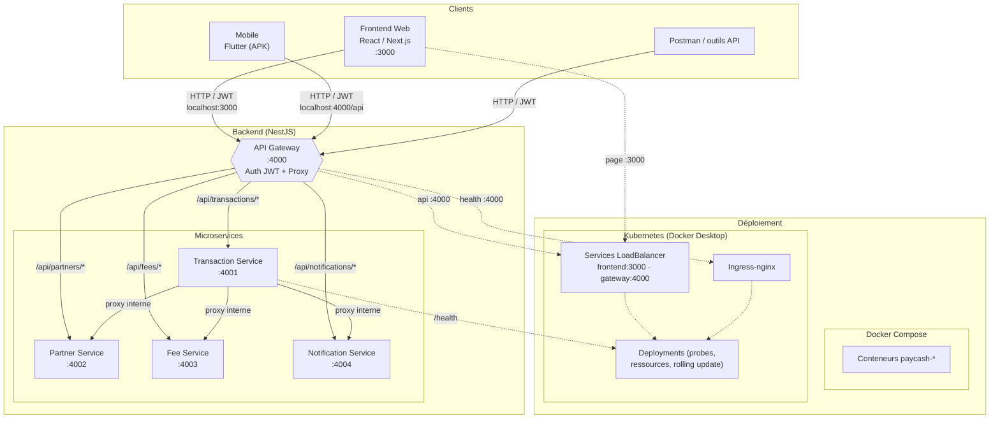

# PayCash Platform

Plateforme de paiement Mobile Money pour le Cameroun. Ce dépôt regroupe l'ensemble des composants du projet : le **backend** (microservices NestJS), le **frontend web** (React / Next.js) et l'**application mobile** (Flutter).

---

## Sommaire

- [Architecture](#architecture)
- [Structure du dépôt](#structure-du-dépôt)
- [Technologies](#technologies)
- [Backend](#backend)
  - [Microservices](#microservices)
  - [Points d'accès (ports)](#points-daccès-ports)
  - [API Gateway](#api-gateway)
  - [Documentation Swagger](#documentation-swagger)
  - [Identifiants par défaut](#identifiants-par-défaut)
- [Frontend (React / Next.js)](#frontend-react--nextjs)
- [Mobile (Flutter)](#mobile-flutter)
- [Docker](#docker)
- [Kubernetes](#kubernetes)
- [Installation et démarrage local](#installation-et-démarrage-local)
- [Variables d'environnement](#variables-denvironnement)
- [Licence](#licence)

---

## Architecture

```
                      ┌──────────────────┐
                      │   Frontend Web   │  React / Next.js  (port 3000)
                      │    (dashboard)   │
                      └────────┬─────────┘
                               │ HTTP / JWT
┌──────────────┐               ▼
│   Mobile     │   ┌──────────────────────┐
│  (Flutter)   │──▶│     API Gateway      │  NestJS  (port 4000)
└──────────────┘   └──────────┬───────────┘
                              │ Proxy /api/<service>/*  (JWT + HMAC)
       ┌──────────────────────┼──────────────────────┐
       ▼                      ▼                      ▼
┌──────────────┐      ┌──────────────┐      ┌──────────────┐
│ Transaction  │      │   Partner    │      │     Fee      │
│   Service    │      │   Service    │      │   Service    │
│   (4001)     │      │   (4002)     │      │   (4003)     │
└──────────────┘      └──────────────┘      └──────────────┘
       └──────────────────────────────┬─────────────────────┘
                                      ▼
                              ┌──────────────┐
                              │ Notification │
                              │   Service    │  (4004)
                              └──────────────┘
```

Toutes les communications entre le frontend / mobile et les microservices passent par l'**API Gateway**, qui gère l'authentification JWT et le proxy des requêtes.

### Diagramme d'architecture (Mermaid)



> Le diagramme se rend automatiquement sur GitHub. Pour un export PNG, copier le bloc dans [Mermaid Live Editor](https://mermaid.live) ou utiliser `npx @mermaid-js/mermaid-cli -i diagram.md -o diagram.png`.

---

## Structure du dépôt

```
paycash-platform/
├── backend/               # Monorepo NestJS (microservices + types partagés)
│   ├── api-gateway/       # API Gateway (auth, proxy, health, Swagger)
│   ├── transaction-service/  # Gestion des transactions Mobile Money
│   ├── partner-service/   # Gestion des partenaires / opérateurs
│   ├── fee-service/       # Calcul des frais de transaction
│   ├── notification-service/ # Envoi de notifications (email, SMS, push)
│   ├── shared-types/      # Types, constantes et DTO partagés
│   ├── paycash_postman.json  # Collection Postman
│   └── docker-compose.yml    # Compose des services backend
├── frontend-react/        # Application web React / Next.js
├── mobile_flutter/        # Application mobile Flutter (+ Dockerfile → APK)
├── k8s/                   # Manifests Kubernetes (Deployments, Services, Ingress, ConfigMaps)
├── docker-compose.yml     # Compose racine (frontend + backend)
└── README.md
```

---

## Technologies

| Composant | Technologie |
|-----------|-------------|
| Backend | NestJS 11, TypeScript, Swagger, JWT (passport), Express |
| Frontend | React 19, Next.js 16, Tailwind CSS 4, TypeScript |
| Mobile | Flutter, Dart, BLoC, Dio, get_it |
| Conteneurisation | Docker, Docker Compose |
| Orchestration | Kubernetes (Docker Desktop, ingress-nginx, kustomize) |
| Style | Prettier, ESLint |

---

## Backend

Le backend est un monorepo NestJS composé de 5 microservices et d'un package de types partagés. La commande racine du backend (`npm run start:dev`) lance l'ensemble des services en parallèle avec `concurrently`.

### Microservices

| Service | Description |
|---------|-------------|
| **API Gateway** (`api-gateway`) | Point d'entrée unique : authentification JWT (`/auth/login`), health check (`/health`), proxy vers les services (`/api/<service>/*`), documentation Swagger |
| **Transaction Service** (`transaction-service`) | Initiation, suivi et historique des transactions Mobile Money |
| **Partner Service** (`partner-service`) | Vérification et gestion des partenaires / opérateurs (Orange, MTN) |
| **Fee Service** (`fee-service`) | Calcul des frais et des taux selon l'opérateur, le type et le montant |
| **Notification Service** (`notification-service`) | Envoi de notifications par email (SMTP), SMS et push |
| **Shared Types** (`shared-types`) | Constants (ports, URLs, préfixes opérateurs, limites), DTO et interfaces partagés |

### Points d'accès (ports)

| Service | Port |
|---------|------|
| API Gateway | `4000` |
| Transaction Service | `4001` |
| Partner Service | `4002` |
| Fee Service | `4003` |
| Notification Service | `4004` |
| Frontend Web | `3000` |

### API Gateway

L'API Gateway expose :

- `POST /auth/login` — génère un token JWT
- `GET /health` — état de l'API Gateway
- `GET/POST /api/<service>/*` — proxy authentifié vers les microservices :
  - `/api/transactions/*` → Transaction Service
  - `/api/partners/*` → Partner Service
  - `/api/fees/*` → Fee Service
  - `/api/notifications/*` → Notification Service

Principaux endpoints des services (accessibles via le proxy) :

| Service | Méthode | Route | Description |
|---------|---------|-------|-------------|
| Transactions | `POST` | `/api/transactions/transactions/initiate` | Initier une transaction |
| Transactions | `GET` | `/api/transactions/transactions/phone/:phoneNumber` | Transactions d'un numéro |
| Transactions | `GET` | `/api/transactions/transactions/:id/status` | Statut d'une transaction |
| Transactions | `GET` | `/api/transactions/transactions` | Historique des transactions |
| Partners | `POST` | `/api/partners/partners/verify` | Vérifier un numéro |
| Partners | `GET` | `/api/partners/partners/:operator` | Infos d'un opérateur |
| Fees | `POST` | `/api/fees/fees/calculate` | Calculer les frais |
| Fees | `GET` | `/api/fees/fees/rates` | Taux en vigueur |
| Notifications | `POST` | `/api/notifications/notifications/email` | Envoyer un email |
| Notifications | `POST` | `/api/notifications/notifications/email/transaction-success` | Email de succès de transaction |

### Documentation Swagger

Chaque service expose sa documentation Swagger :

- Gateway : `http://localhost:4000/api/docs`
- Transaction : `http://localhost:4001/api/docs`
- Partner : `http://localhost:4002/api/docs`
- Fee : `http://localhost:4003/api/docs`
- Notification : `http://localhost:4004/api/docs`

### Identifiants par défaut

Login (API Gateway) :

```
username: admin
password: paycash2024
```

> ⚠️ À modifier impérativement avant toute mise en production.

Une collection **Postman** est disponible : `backend/paycash_postman.json`.

---

## Frontend (React / Next.js)

Application web de gestion (dashboard) située dans `frontend-react/`.

- Framework : **Next.js 16** (App Router) avec **React 19**
- Styles : **Tailwind CSS 4** (IBM Plex Sans / IBM Plex Mono)
- Pages actuelles : `/login` (authentification), `/transactions` (liste des transactions)
- Le trafic API passe par la variable `NEXT_PUBLIC_API_URL` (gateway : `http://localhost:4000`)

Scripts disponibles :

```bash
cd frontend-react
npm install
npm run dev        # serveur de développement (http://localhost:3000)
npm run build      # build de production
npm run start      # serveur de production
npm run lint       # lint ESLint
```

---

## Mobile (Flutter)

Application mobile de transfert d'argent dans `mobile_flutter/`. Parcours : saisie du numéro et du montant → calcul des frais → résumé de la transaction → initiation du paiement.

- Architecture : **Clean Architecture** par feature (data / presentation)
- State management : **flutter_bloc**, injection de dépendances **get_it**
- Réseau : **dio** (API Gateway : `http://localhost:4000/api`)
- Thème : **google_fonts**

```
lib/
├── core/
│   ├── di/injection_container.dart     # get_it (Dio, Service, Repo, Bloc)
│   ├── theme/app_colors.dart           # Couleurs de l'app
│   └── utils/format.dart               # Formatage montant / taux
└── features/
    └── payment/
        ├── data/
        │   ├── models/                 # FeeCalculation, TransactionResult
        │   ├── services/payment_service.dart   # Appels HTTP vers l'API NestJS
        │   └── repositories/payment_repository.dart
        └── presentation/
            ├── bloc/                   # payment_bloc / _event / _state
            └── screens/                # payment_screen, fee_summary_screen
```

Scripts disponibles :

```bash
cd mobile_flutter
flutter pub get
flutter run                          # lance l'app sur un device/émulateur
flutter analyze                     # analyse statique
flutter test                        # tests unitaires
flutter build apk                   # build Android
docker build -t paycash/mobile-flutter:latest .   # build APK via Docker (artefact /artifacts/app-release.apk)
```

---

## Docker

Un `docker-compose.yml` à la racine orchestre l'ensemble du stack (frontend + backend). Le backend possède également son propre compose (`backend/docker-compose.yml`).

```bash
# Lancer toute la plateforme
docker compose up --build

# Lancer en arrière-plan
docker compose up -d --build

# Arrêter
docker compose down
```

Conteneurs créés :

| Conteneur | Service |
|-----------|---------|
| `paycash-gateway` | API Gateway (port 4000) |
| `paycash-transaction` | Transaction Service (4001) |
| `paycash-partner` | Partner Service (4002) |
| `paycash-fee` | Fee Service (4003) |
| `paycash-notification` | Notification Service (4004) |
| `paycash-frontend` | Frontend Web (port 3000) |

Tous les conteneurs partagent le réseau `paycash-net`.

### Image Flutter (mobile)

Le dossier `mobile_flutter/` contient son propre `Dockerfile` : il compile l'application en **APK Android release** et expose l'artefact sans exécuter de serveur (l'app mobile est livrée sur un device, pas déployée comme un service).

```bash
docker build -t paycash/mobile-flutter:latest mobile_flutter

# Récupérer l'APK compilé
docker create --name paycash-mobile-extract paycash/mobile-flutter:latest
docker cp paycash-mobile-extract:/artifacts/app-release.apk ./app-release.apk
docker rm paycash-mobile-extract
```

> La génération de l'APK mobile est gérée par **GitHub Actions** (hors périmètre Kubernetes).

---

## Kubernetes

Les manifests Kubernetes se trouvent dans `k8s/` (namespace `paycash`), déployés avec `kubectl apply -k k8s/` (kustomize). Chaque Deployment inclut **probes de santé** (startup / liveness / readiness), **limites de ressources** (CPU / mémoire) et **stratégie RollingUpdate**.

### Prérequis

- **Docker Desktop** avec l'option *Settings → Kubernetes → Enable Kubernetes* activée
- `kubectl` (fourni avec Docker Desktop)

### Fichiers

| Fichier | Contenu |
|---------|---------|
| `namespace.yaml` | Namespace `paycash` |
| `configmap.yaml` | Configurations partagées (URLs internes, ports, SMTP, API URL frontend) |
| `secret.yaml` | Secrets JWT / HMAC / SMTP (⚠️ à remplacer en production) |
| `gateway.yaml` | API Gateway : Deployment + Service (LoadBalancer `:4000`) |
| `transaction-service.yaml` | Transaction Service : Deployment + Service (`:4001`, interne) |
| `microservices.yaml` | Partner / Fee / Notification Services : Deployment + Service (internes) |
| `frontend.yaml` | Frontend React : Deployment + Service (LoadBalancer `:3000`) |
| `ingress.yaml` | Ingress NGINX (frontend `/` + API `/api`, `/auth`, `/health`) |
| `kustomization.yaml` | Agrégation des manifests |

### Démarrage / arrêt (2 commandes)

```bash
# CRÉER / LANCER
kubectl apply -f https://raw.githubusercontent.com/kubernetes/ingress-nginx/main/deploy/static/provider/cloud/deploy.yaml && kubectl apply -k k8s/

# SUPPRIMER
kubectl delete -k k8s/ && kubectl delete -f https://raw.githubusercontent.com/kubernetes/ingress-nginx/main/deploy/static/provider/cloud/deploy.yaml
```

### Points d'accès en local (dev)

Les Services `frontend` et `gateway` sont en `type: LoadBalancer` → Docker Desktop les expose directement sur la machine :

| URL | Accès |
|-----|-------|
| `http://localhost:3000/login` | Frontend React (dashboard) |
| `http://localhost:4000/auth/login` | Login (token JWT) |
| `http://localhost:4000/api/transactions/transactions` | Transactions (proxy gateway) |
| `http://localhost:4000/health` | Health check gateway |
| `http://localhost:4000/api/docs` | Swagger |

Le frontend cible l'API via `NEXT_PUBLIC_API_URL` (défaut : `http://localhost:4000`), injecté au **build** de l'image :

```bash
docker build -t paycash/frontend-react:latest --build-arg NEXT_PUBLIC_API_URL=http://localhost:4000 frontend-react
```

### Images des services

```bash
# Depuis le dossier backend/
docker build -t paycash/api-gateway:latest        -f api-gateway/Dockerfile .
docker build -t paycash/transaction-service:latest -f transaction-service/Dockerfile .
docker build -t paycash/partner-service:latest     -f partner-service/Dockerfile .
docker build -t paycash/fee-service:latest         -f fee-service/Dockerfile .
docker build -t paycash/notification-service:latest -f notification-service/Dockerfile .
```

### Endpoints de santé

Chaque service expose `GET /health` (ajouté dans `src/modules/health/`) pour les probes : `transaction-service`, `partner-service`, `fee-service`, `notification-service`, `api-gateway`.

---

## Installation et démarrage local

### 1. Backend

Prérequis : Node.js ≥ 20, npm ou yarn.

```bash
cd backend
npm install          # ou yarn install

# Lancer tous les microservices en parallèle
npm run start:dev

# Ou lancer un service individuellement
npm run start:dev:gateway
npm run start:dev:transaction
npm run start:dev:partner
npm run start:dev:fee
npm run start:dev:notification

# Build de production
npm run build

# Tests
npm test
npm run test:cov
```

### 2. Frontend

```bash
cd frontend-react
npm install
npm run dev          # http://localhost:3000
```

### 3. Mobile

```bash
cd mobile_flutter
flutter pub get
flutter run
```

---

## Variables d'environnement

Les fichiers `.env` sont fournis en exemple dans chaque service (`backend/<service>/.env`).

| Variable | Service | Description |
|----------|---------|-------------|
| `PORT` | Tous | Port d'écoute du service |
| `JWT_SECRET` | Gateway + services | Clé secrète JWT |
| `HMAC_SECRET` | Gateway / Transaction | Clé HMAC pour la signature des requêtes |
| `TRANSACTION_SERVICE_URL` | Gateway / Transaction | URL du service de transactions |
| `PARTNER_SERVICE_URL` | Gateway / Transaction | URL du service partenaire |
| `FEE_SERVICE_URL` | Gateway / Transaction | URL du service de frais |
| `NOTIFICATION_SERVICE_URL` | Gateway | URL du service de notifications |
| `SMTP_HOST`, `SMTP_PORT`, `SMTP_USER`, `SMTP_PASS` | Notification | Configuration SMTP |
| `FROM_EMAIL` | Notification | Adresse d'expéditeur |
| `NEXT_PUBLIC_API_URL` | Frontend | URL de l'API Gateway |

> ⚠️ Les valeurs par défaut (`JWT_SECRET`, `HMAC_SECRET`, identifiants) sont **uniquement** destinées au développement.

---

## Licence

Projet privé — © PayCash Team. Tous droits réservés.
